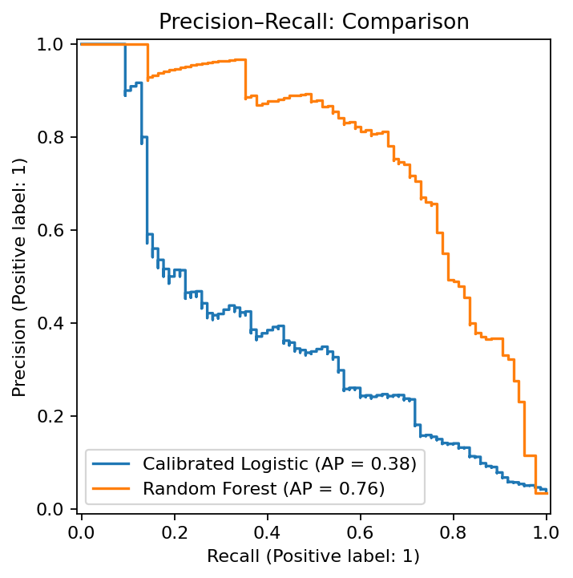
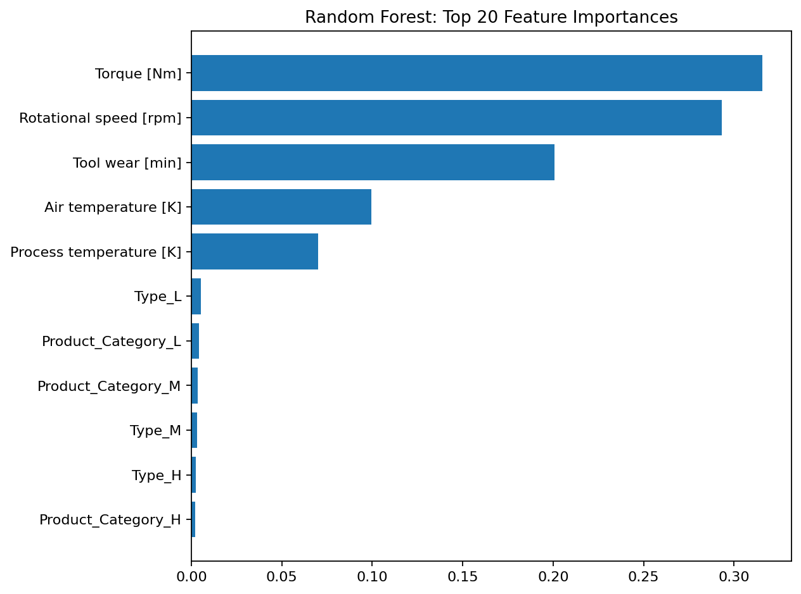

# Predictive Maintenance (AI4I 2020)

**Problem**  
This project explores how sensor data can be used to predict machine failures before they happen.  
The idea is to help reduce unexpected downtime by giving maintenance teams enough time to plan repairs in advance.
- **Why it matters:** In maintenance, **high precision** reduces false alarms and avoids wasting technician time; **recall** at that precision shows how many real failures we can catch.

**Data**  
AI4I 2020 Predictive Maintenance ([UCI ML Repository](https://archive.ics.uci.edu/ml/datasets/AI4I+2020+Predictive+Maintenance+Dataset)). Synthetic but modeled after real industrial data.
- Download CSV: `ai4i2020.csv` from the UCI page and place it in `data/` folder.
- Contains ~10,000 rows, 14 columns (temperature, rotational speed, torque, tool wear, and failure flags).
- Target: **Machine failure** (binary).

**Failure Type Definitions**

| Code | Failure Mode | Description |
|------|---------------|--------------|
| **TWF** | Tool Wear Failure | Machine failed due to excessive tool wear |
| **HDF** | Heat Dissipation Failure | Failure caused by overheating or poor cooling |
| **PWF** | Power Failure | Electrical or power system failure |
| **OSF** | Overstrain Failure | Mechanical stress or overload failure |
| **RNF** | Random Failure | Unclassified or random event leading to failure |

**Data quality note:**  
- Verified that the overall `Machine failure` flag aligns with these five subtype failures (`TWF–RNF`).  
- A small number of rows show minor inconsistencies; treated as negligible label noise.
- **Leakage control:** The five subtype flags (**TWF, HDF, PWF, OSF, RNF**) are dropped before modeling (used only to validate the target).

**METHOD (plan)**  
1. *EDA*: distributions, correlations, label balance, leakage checks.  
2. *Target framing*: `failure in next 7 days` (binary) or `failure_now` as provided.  
3. *Baselines*: majority class; logistic regression with class weights.  
4. *Models*: tree-based (RandomForest, GradientBoosting) and calibrated logistic.  
5. *Validation*: stratified CV and temporal split sensitivity check.  
6. *Metrics*: PR-AUC, ROC-AUC, Recall at fixed Precision (operating point).  
7. *Explainability*: SHAP/feature importances.  
8. *Business impact*: translate operating point/results to avoid downtime.

**Method (actual)**  
1. **EDA:** Distributions, class balance, leakage check (drop TWF/HDF/PWF/OSF/RNF).  
2. **Feature engineering:** Extract `Product_Category` from `Product ID`; remove `Product ID`.  
3. **Split & preprocessing:** Stratified split; version-safe `OneHotEncoder`;  
   - *Logistic pipeline:* scale numerics + OHE categoricals  
   - *Tree pipeline:* passthrough numerics + OHE categoricals  
4. **Models:**  
   - **Calibrated Logistic Regression** (`class_weight="balanced"` + `CalibratedClassifierCV`)  
   - **Random Forest** baseline (`n_estimators=400`, `class_weight="balanced"`)  
5. **Evaluation:** PR-AUC, ROC-AUC, and Recall @ 90% Precision via a custom utility.  
6. **Interpretation:** **Top-20 RF feature importances** (Torque, Rotational speed, Tool wear typically dominate).  
7. **Business framing:** Choose operating points that minimize false alarms while catching meaningful failures.


**Results**  
| Model | PR-AUC | Recall @ 90% Precision | Notes |
|------|--------|-------------------------|-------|
| Random Forest | see `assets/metrics_summary.csv` | see `assets/metrics_summary.csv` | Strong non-linear baseline |
| Calibrated Logistic | see `assets/metrics_summary.csv` | see `assets/metrics_summary.csv` | Interpretable, calibrated scores |
> Detailed values are in `assets/metrics_summary.csv` and the comparison (uplift) is in `assets/operating_point_uplift.csv`.


**Key visuals**  
  


**Business Impact**  
At **90% precision**, the model detects **35.3%** of true failures, versus **12.9%** for the baseline. This is an improvement of **22.4 percentage points**, yielding fewer false alarms and more predictable maintenance scheduling.


**How to run**  
```bash
# (optional) python -m venv .venv && source .venv/bin/activate
pip install -r requirements.txt

# Add data
mkdir -p data
# Place ai4i2020.csv into data/

# Open and run the notebook
jupyter lab  # or: jupyter notebook
# Run: notebook/predictive_maintenance.ipynb end-to-end
```

The notebook saves curated outputs directly to **`assets/`**:
- `pr_curve_comparison.png`
- `feature_importances_rf.png`
- `metrics_summary.csv`
- `operating_point_uplift.csv`

---

> Data source: *[UCI Machine Learning Repository – AI4I 2020 Predictive Maintenance Dataset](https://archive.ics.uci.edu/ml/datasets/AI4I+2020+Predictive+Maintenance+Dataset)*